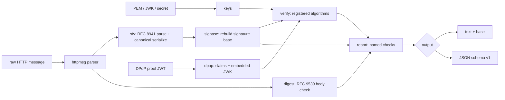

# httpsigcheck

[English](README.md) | [中文](README.zh.md) | [日本語](README.ja.md)

[](LICENSE) [](go.mod) [](CHANGELOG.md)  [](CONTRIBUTING.md)

**httpsigcheck：RFC 9421 HTTP メッセージ署名と RFC 9449 DPoP 証明をオフラインで検証し、実際に署名された signature base を提示して失敗を説明する、オープンソースの依存ゼロ CLI。**


```bash
git clone https://github.com/JaydenCJ/httpsigcheck && cd httpsigcheck
go build -o httpsigcheck ./cmd/httpsigcheck    # single static binary, stdlib only
```

> プレリリース：v0.1.0 はまだどのパッケージレジストリにも公開されていません。上記の手順でソースからビルドしてください（Go ≥1.22 なら可）。

## なぜ httpsigcheck？

HTTP メッセージ署名（RFC 9421）と DPoP（RFC 9449）は OAuth 2、FAPI 2.0、オープンバンキング各プロファイルへ急速に広がっています —— それなのに署名が失敗したとき得られるエラーは `invalid_signature` の一言だけ。原因が暗号処理そのものであることはほぼありません。核心は *signature base*、双方がメッセージから独立に導出する正規化テキストであり、どんな食い違いも —— プロキシがヘッダを剥がした、ポートの正規化が違った、クエリパラメータが再エンコードされた —— 音もなくそれを壊します。汎用の JWT デバッガでは手も足も出ません：RFC 9421 署名はそもそも JWT ではなく、DPoP 証明は JWT ではあるものの、その価値はクレームを HTTP リクエストと突き合わせることにこそあり、それはトークンデコーダのやらない仕事です。httpsigcheck は RFC 9421 §2 に従い生メッセージから base を再構築し —— 派生コンポーネント、`;sf`/`;key`/`;bs` のフィールド規則、厳密な `@query-param` 再エンコード —— それを提示し、各検証ルールを説明付きの名前付きチェックとして実行し、DPoP 証明にも同じことを行います（`ath` トークンハッシュや RFC 7638 `cnf.jkt` サムプリント結合を含む）。完全オフライン、入力はファイル、時計は固定可能。

| | httpsigcheck | jwt.io 系デバッガ | jose/step CLI | openssl スクリプト |
|---|---|---|---|---|
| RFC 9421 signature base の再構築 | ✅ 表示する | ❌ | ❌ | 手作業でミスしやすい |
| DPoP クレーム検証（htm/htu/iat/ath/jkt） | ✅ | ❌ デコードのみ | ❌ 署名のみ | ❌ |
| 検証が*なぜ*失敗したかの説明 | ✅ 名前付きチェック | ❌ | ❌ | ❌ |
| RFC 9530 Content-Digest を body と照合 | ✅ | ❌ | ❌ | 手作業 |
| alg/鍵の混同を設計で拒否 | ✅ | 対象外 | 部分的 | ❌ |
| キャプチャ済みトラフィックをオフライン処理 | ✅ `--now` で時計固定 | ❌ Web サイトに貼り付け | ✅ | ✅ |
| ランタイム依存 | 0 | ブラウザ/SaaS | Go/npm 依存 | OpenSSL |

<sub>依存数の確認日 2026-07-12：httpsigcheck が import するのは Go 標準ライブラリのみ。`crypto/ed25519`・`crypto/ecdsa`・`crypto/rsa`・`crypto/hmac` で RFC 9421 登録アルゴリズムを全て賄えます。</sub>

## 機能

- **signature base が見える** — `verify` は再構築した base を丸ごと表示し、`base` はそれだけを出力。検証側の導出と署名側のログを diff すれば、食い違う行を数秒で特定できます。
- **コンポーネント代数を完備** — 派生コンポーネント（`@method` … `@status`）、複数インスタンスのフィールド結合、構造化型レジストリに基づく `;sf` 正規化再シリアライズ、`;key` 辞書メンバー抽出、`;bs` バイト列ラップ、同名反復対応の `@query-param` 厳密再エンコード。
- **登録アルゴリズムを全部** — ed25519、ecdsa-p256-sha256、ecdsa-p384-sha384（生の r||s、形式違いには ASN.1-DER のヒント付き）、rsa-pss-sha512、rsa-v1_5-sha256、hmac-sha256。`alg` パラメータは攻撃者制御の入力として扱い、鍵と一致しなければ失敗します。
- **DPoP 証明をエンドツーエンドで** — 埋め込み JWK での JWS 検証（`none` と HS* は名指しで拒否、秘密鍵の混入は漏えいとして指摘）、htm/htu 正規化、iat 鮮度ウィンドウ、`ath` アクセストークンハッシュ、nonce エコー、`cnf.jkt` 結合用の RFC 7638 サムプリント。
- **body 完全性を正直に報告** — Content-Digest（RFC 9530）を実際の body バイト列と照合し、署名が有効でも body を*カバーしていない*場合は安全と匂わせずその旨を明言します。
- **決定的でスクリプト可能** — `--now`/`--skew` がキャプチャや CI 向けに時計を固定し、JSON 出力は `schema_version: 1` を持ち、終了コードは検証失敗（1）・用法エラー（2）・入力エラー（3）を区別します。
- **依存ゼロ・完全オフライン** — Go 標準ライブラリのみ。鍵もメッセージもファイルとフラグから。ネットワーク通信もテレメトリも一切ありません。

## クイックスタート

```bash
go build -o httpsigcheck ./cmd/httpsigcheck
./httpsigcheck verify --key examples/ed25519-public.pem --now 1783814400 examples/signed-request.http
```

実際にキャプチャした出力：

```text
httpsigcheck verify — examples/signed-request.http
message: POST request for /payments, 5 header fields, 53-byte body

signature "sig1"
  signature base:
    | "@method": POST
    | "@authority": api.example.test
    | "@path": /payments
    | "content-digest": sha-256=:nVlzC8VTtrocY1BHIIbbI7A+znTUnXEwu82/38042Y8=:
    | "@signature-params": ("@method" "@authority" "@path" "content-digest");created=1783814400;keyid="payments-key-1";alg="ed25519"
  checks:
    base       ok    reconstructed: 4 component lines + @signature-params
    alg        ok    ed25519 (from the alg signature parameter)
    keyid      skip  signature names keyid "payments-key-1"; the supplied key file carries no kid to compare (JWK files with a kid are compared automatically)
    created    ok    2026-07-12T00:00:00Z (0 s ago)
    signature  ok    64-byte signature verifies over the 265-byte base
    body       ok    signature covers content-digest, binding the body (see the digest check below)

content-digest:
  sha-256  ok    matches the body (53 bytes)

verify: PASS (1 of 1 signature valid)
```

DPoP 証明を、それが結合を主張するリクエストと照合して検証（実出力、checks 部分の抜粋）：

```text
checks:
  format     ok    compact JWS, all three parts decode
  typ        ok    header typ is "dpop+jwt"
  jwk        ok    embedded public key is ecdsa-p256 (thumbprint 0hIJc9x8a1ZPgKvi46zZs9i7Q-X2xwEseMpnBR3Hq24)
  signature  ok    ES256 signature verifies with the embedded ecdsa-p256 key
  jti        ok    present (18 chars); replay detection is the server's job — check your jti cache
  htm        ok    bound to POST
  htu        ok    bound to https://as.example.test/token
  iat        ok    issued 0 s ago, within the 300 s window

dpop: PASS
```

改ざん版の双子ファイル（`examples/tampered-request.http`、body の金額を 10 から 900 に改変）は終了コード 1 で終わります：署名は依然有効 —— カバーしているのは digest *フィールド*であって body ではない —— そのため判定行は `FAIL (1 of 1 signature valid, but a content-digest check failed)` となり、すり替えを捕まえるのが `sha-256 FAIL … content was modified after signing` の行です。

## CLI リファレンス

`httpsigcheck [verify|base|dpop|version]` — 終了コード：0 検証成功、1 検証失敗、2 用法エラー、3 入力エラー。

| フラグ | 既定値 | 効果 |
|---|---|---|
| `--key FILE` | — | 公開鍵：PEM（PKIX/PKCS#1/証明書）または JWK JSON（verify） |
| `--secret VALUE` | — | hmac-sha256 共有シークレット、生文字列か `base64:…`（verify） |
| `--label NAME` | 全ラベル | この署名ラベルのみ検証、繰り返し指定可（verify） |
| `--alg NAME` | メッセージ/鍵から | アルゴリズムを強制。鍵と不一致なら即失敗（verify） |
| `--scheme NAME` | `https` | `@scheme`/`@target-uri`/既定ポートに仮定するスキーム（verify、base） |
| `--now TIME` | システム時計 | 検証時刻、unix 秒または RFC 3339 —— キャプチャでは固定を（verify、dpop） |
| `--skew SECONDS` | `30` | 許容する時計ずれ（verify、dpop） |
| `--max-age SECONDS` | 無効 / `300`（dpop） | これより古い署名/証明を拒否（verify、dpop） |
| `--components 'LIST'` | — | Signature-Input フィールドなしで臨時 base を構築（base） |
| `--method`、`--url` | — | 期待する `htm`/`htu` の結合（dpop） |
| `--access-token`、`--jkt`、`--nonce` | — | `ath` ハッシュ・`cnf.jkt` サムプリント・nonce エコーを検証（dpop） |
| `--format FORMAT` | `text` | `text` または `json`、`schema_version: 1` 付き（verify、dpop） |

base がどの規則でどう再構築されるか、そして失敗カタログ：[docs/signature-base.md](docs/signature-base.md)。

## 検証

このリポジトリは CI を同梱しません。上記の主張はすべてローカル実行で検証されます：

```bash
go test ./...            # 89 deterministic tests, offline, < 5 s
bash scripts/smoke.sh    # end-to-end CLI check, prints SMOKE OK
```

## アーキテクチャ



## ロードマップ

- [x] v0.1.0 — RFC 9421 base の完全な再構築と検証、6 アルゴリズム、Content-Digest チェック、`base` サブコマンド、jkt 結合付き DPoP 証明検証、89 テスト + smoke スクリプト
- [ ] `;req` リクエスト結合レスポンス署名（レスポンスをリクエストと照合検証）
- [ ] `;tr` トレーラーコンポーネント
- [ ] テストフィクスチャ用に Signature-Input/Signature を生成する `sign` サブコマンド
- [ ] Accept-Signature ネゴシエーション支援
- [ ] JWKS ファイル（複数鍵）と keyid ベースの選択

全リストは [open issues](https://github.com/JaydenCJ/httpsigcheck/issues) をご覧ください。

## コントリビュート

Issue・ディスカッション・PR を歓迎します —— ローカルワークフロー（フォーマット、vet、テスト、`SMOKE OK`）は [CONTRIBUTING.md](CONTRIBUTING.md) を参照。入門向けタスクは [good first issue](https://github.com/JaydenCJ/httpsigcheck/issues?q=is%3Aissue+is%3Aopen+label%3A%22good+first+issue%22) のラベル付き、設計の議論は [Discussions](https://github.com/JaydenCJ/httpsigcheck/discussions) で。

## ライセンス

[MIT](LICENSE)
