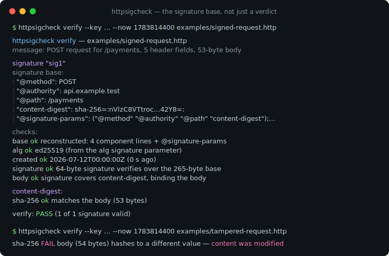
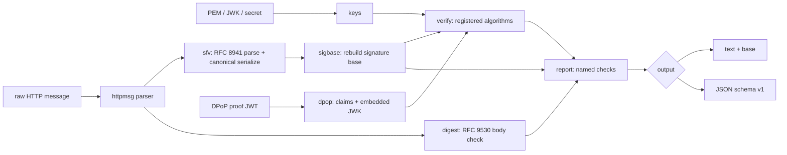

# httpsigcheck

[English](README.md) | [中文](README.zh.md) | [日本語](README.ja.md)

[](LICENSE) [](go.mod) [](CHANGELOG.md)  [](CONTRIBUTING.md)

**httpsigcheck：an open-source, zero-dependency CLI that verifies RFC 9421 HTTP Message Signatures and RFC 9449 DPoP proofs offline — and explains failures by showing the exact signature base that was signed.**



```bash
git clone https://github.com/JaydenCJ/httpsigcheck && cd httpsigcheck
go build -o httpsigcheck ./cmd/httpsigcheck    # single static binary, stdlib only
```

> Pre-release: v0.1.0 is not tagged on a package registry yet; build from source as above (any Go ≥1.22).

## Why httpsigcheck?

HTTP Message Signatures (RFC 9421) and DPoP (RFC 9449) are spreading through OAuth 2, FAPI 2.0, and open-banking profiles — and when a signature fails, the error you get is `invalid_signature` and nothing else. The failure is almost never the cryptography: it is the *signature base*, a canonical text both sides derive independently from the message, and any disagreement — a proxy stripped a header, the port was normalized differently, a query parameter was re-encoded — breaks it invisibly. Generic JWT debuggers cannot help: an RFC 9421 signature is not a JWT at all, and a DPoP proof is a JWT whose entire value lies in cross-checking its claims against the HTTP request, which token decoders do not do. httpsigcheck rebuilds the base from the raw message per RFC 9421 §2 — derived components, `;sf`/`;key`/`;bs` field rules, strict `@query-param` re-encoding — shows it to you, runs every verification rule as a named check with an explanation, and does the same for DPoP proofs including `ath` token hashes and RFC 7638 `cnf.jkt` thumbprint binding. Offline, from files, with a pinnable clock.

| | httpsigcheck | jwt.io-style debuggers | jose/step CLI | openssl scripting |
|---|---|---|---|---|
| Rebuilds the RFC 9421 signature base | ✅ shows it | ❌ | ❌ | manual, error-prone |
| Verifies DPoP claims (htm/htu/iat/ath/jkt) | ✅ | ❌ decode only | ❌ signature only | ❌ |
| Explains *why* verification failed | ✅ named checks | ❌ | ❌ | ❌ |
| Checks Content-Digest (RFC 9530) against the body | ✅ | ❌ | ❌ | manual |
| Rejects alg/key confusion by design | ✅ | n/a | partially | ❌ |
| Works offline on captured traffic | ✅ `--now` pins the clock | ❌ paste into a website | ✅ | ✅ |
| Runtime dependencies | 0 | browser/SaaS | Go/npm deps | OpenSSL |

<sub>Dependency counts checked 2026-07-12: httpsigcheck imports the Go standard library only; `crypto/ed25519`, `crypto/ecdsa`, `crypto/rsa`, and `crypto/hmac` cover every registered RFC 9421 algorithm.</sub>

## Features

- **Signature base, visible** — `verify` prints the exact reconstructed base and `base` prints nothing else, so you can diff the verifier's derivation against your signer's log and find the disagreeing line in seconds.
- **The full component algebra** — derived components (`@method` … `@status`), multi-instance field joining, `;sf` canonical re-serialization against a structured-type registry, `;key` Dictionary member extraction, `;bs` byte wrapping, and `@query-param` strict re-encoding with repeated-name handling.
- **Every registered algorithm** — ed25519, ecdsa-p256-sha256, ecdsa-p384-sha384 (raw r||s, with an ASN.1-DER hint when you feed it the wrong shape), rsa-pss-sha512, rsa-v1_5-sha256, hmac-sha256; the `alg` parameter is treated as attacker-controlled and must match the key.
- **DPoP proofs end to end** — JWS check with the embedded JWK (`none` and HS* rejected by name, private-key leaks called out), htm/htu normalization, iat freshness windows, `ath` access-token hashes, nonce echo, and RFC 7638 thumbprints for `cnf.jkt` binding.
- **Body integrity, honestly reported** — Content-Digest (RFC 9530) is checked against the real body bytes, and a valid signature that does *not* cover the body says so instead of implying safety.
- **Deterministic and scriptable** — `--now`/`--skew` pin the clock for captured traffic and CI, JSON output carries `schema_version: 1`, and exit codes separate verification failure (1) from usage (2) and input errors (3).
- **Zero dependencies, fully offline** — Go standard library only; keys and messages come from files and flags. No network, no telemetry, ever.

## Quickstart

```bash
go build -o httpsigcheck ./cmd/httpsigcheck
./httpsigcheck verify --key examples/ed25519-public.pem --now 1783814400 examples/signed-request.http
```

Real captured output:

```text
httpsigcheck verify — examples/signed-request.http
message: POST request for /payments, 5 header fields, 53-byte body

signature "sig1"
  signature base:
    | "@method": POST
    | "@authority": api.example.test
    | "@path": /payments
    | "content-digest": sha-256=:nVlzC8VTtrocY1BHIIbbI7A+znTUnXEwu82/38042Y8=:
    | "@signature-params": ("@method" "@authority" "@path" "content-digest");created=1783814400;keyid="payments-key-1";alg="ed25519"
  checks:
    base       ok    reconstructed: 4 component lines + @signature-params
    alg        ok    ed25519 (from the alg signature parameter)
    keyid      skip  signature names keyid "payments-key-1"; the supplied key file carries no kid to compare (JWK files with a kid are compared automatically)
    created    ok    2026-07-12T00:00:00Z (0 s ago)
    signature  ok    64-byte signature verifies over the 265-byte base
    body       ok    signature covers content-digest, binding the body (see the digest check below)

content-digest:
  sha-256  ok    matches the body (53 bytes)

verify: PASS (1 of 1 signature valid)
```

Verify a DPoP proof against the request it claims to be bound to (real output, abridged to the checks):

```text
checks:
  format     ok    compact JWS, all three parts decode
  typ        ok    header typ is "dpop+jwt"
  jwk        ok    embedded public key is ecdsa-p256 (thumbprint 0hIJc9x8a1ZPgKvi46zZs9i7Q-X2xwEseMpnBR3Hq24)
  signature  ok    ES256 signature verifies with the embedded ecdsa-p256 key
  jti        ok    present (18 chars); replay detection is the server's job — check your jti cache
  htm        ok    bound to POST
  htu        ok    bound to https://as.example.test/token
  iat        ok    issued 0 s ago, within the 300 s window

dpop: PASS
```

The tampered twin (`examples/tampered-request.http`, the amount changed from 10 to 900 in the body) exits 1: the signature still verifies — it covers the digest *field*, not the body — so the verdict reads `FAIL (1 of 1 signature valid, but a content-digest check failed)` and the `sha-256 FAIL … content was modified after signing` line catches the swap.

## CLI reference

`httpsigcheck [verify|base|dpop|version]` — exit codes: 0 verified, 1 verification failed, 2 usage error, 3 input error.

| Flag | Default | Effect |
|---|---|---|
| `--key FILE` | — | public key: PEM (PKIX/PKCS#1/certificate) or JWK JSON (verify) |
| `--secret VALUE` | — | hmac-sha256 shared secret, raw or `base64:…` (verify) |
| `--label NAME` | all labels | verify only this signature label, repeatable (verify) |
| `--alg NAME` | from message/key | force the algorithm; mismatch with the key fails closed (verify) |
| `--scheme NAME` | `https` | scheme assumed for `@scheme`/`@target-uri`/default ports (verify, base) |
| `--now TIME` | wall clock | verification time, unix seconds or RFC 3339 — pin it for captures (verify, dpop) |
| `--skew SECONDS` | `30` | tolerated clock skew (verify, dpop) |
| `--max-age SECONDS` | off / `300` (dpop) | reject signatures/proofs older than this (verify, dpop) |
| `--components 'LIST'` | — | build an ad-hoc base without a Signature-Input field (base) |
| `--method`, `--url` | — | expected `htm`/`htu` bindings (dpop) |
| `--access-token`, `--jkt`, `--nonce` | — | check `ath` hash, `cnf.jkt` thumbprint, nonce echo (dpop) |
| `--format FORMAT` | `text` | `text` or `json` with `schema_version: 1` (verify, dpop) |

How the base is rebuilt, rule by rule, and the failure catalog: [docs/signature-base.md](docs/signature-base.md).

## Verification

This repository ships no CI; every claim above is verified by local runs:

```bash
go test ./...            # 89 deterministic tests, offline, < 5 s
bash scripts/smoke.sh    # end-to-end CLI check, prints SMOKE OK
```

## Architecture



## Roadmap

- [x] v0.1.0 — full RFC 9421 base reconstruction and verification, six algorithms, Content-Digest checks, `base` subcommand, DPoP proof verification with jkt binding, 89 tests + smoke script
- [ ] `;req` request-bound response signatures (verify a response against its request)
- [ ] `;tr` trailer components
- [ ] `sign` subcommand to produce Signature-Input/Signature for test fixtures
- [ ] Accept-Signature negotiation helper
- [ ] JWKS files (multi-key) with keyid-based selection

See the [open issues](https://github.com/JaydenCJ/httpsigcheck/issues) for the full list.

## Contributing

Issues, discussions and pull requests are welcome — see [CONTRIBUTING.md](CONTRIBUTING.md) for the local workflow (format, vet, tests, `SMOKE OK`). Good entry points are labelled [good first issue](https://github.com/JaydenCJ/httpsigcheck/issues?q=is%3Aissue+is%3Aopen+label%3A%22good+first+issue%22), and design questions live in [Discussions](https://github.com/JaydenCJ/httpsigcheck/discussions).

## License

[MIT](LICENSE)
