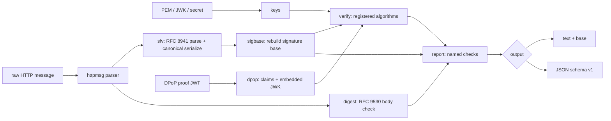

# httpsigcheck

[English](README.md) | [中文](README.zh.md) | [日本語](README.ja.md)

[](LICENSE) [](go.mod) [](CHANGELOG.md)  [](CONTRIBUTING.md)

**httpsigcheck：开源零依赖 CLI，离线校验 RFC 9421 HTTP 消息签名与 RFC 9449 DPoP 证明 —— 并通过展示实际被签名的 signature base 来解释失败原因。**


```bash
git clone https://github.com/JaydenCJ/httpsigcheck && cd httpsigcheck
go build -o httpsigcheck ./cmd/httpsigcheck    # single static binary, stdlib only
```

> 预发布：v0.1.0 尚未发布到任何包仓库；请按上述方式从源码构建（任意 Go ≥1.22）。

## 为什么选 httpsigcheck？

HTTP 消息签名（RFC 9421）与 DPoP（RFC 9449）正随 OAuth 2、FAPI 2.0 与开放银行规范快速普及 —— 而签名一旦失败，你得到的报错只有一句 `invalid_signature`。问题几乎从来不在密码学本身：症结在于 *signature base*，一段由双方各自从消息独立推导出的规范化文本，任何分歧 —— 代理剥掉了某个头、端口被以不同方式归一化、查询参数被重新编码 —— 都会无声地破坏它。通用 JWT 调试器帮不上忙：RFC 9421 签名根本不是 JWT，而 DPoP 证明虽是 JWT，其全部价值却在于把声明与 HTTP 请求交叉核对，这正是 token 解码器不做的事。httpsigcheck 依照 RFC 9421 §2 从原始消息重建 base —— 派生组件、`;sf`/`;key`/`;bs` 字段规则、严格的 `@query-param` 重编码 —— 把它展示给你，把每条校验规则作为具名检查并附解释逐一执行，并对 DPoP 证明做同样的事，包括 `ath` 令牌哈希与 RFC 7638 `cnf.jkt` 指纹绑定。完全离线，输入来自文件，时钟可固定。

| | httpsigcheck | jwt.io 式调试器 | jose/step CLI | openssl 脚本 |
|---|---|---|---|---|
| 重建 RFC 9421 signature base | ✅ 直接展示 | ❌ | ❌ | 手工、易错 |
| 校验 DPoP 声明（htm/htu/iat/ath/jkt） | ✅ | ❌ 仅解码 | ❌ 仅签名 | ❌ |
| 解释校验*为何*失败 | ✅ 具名检查 | ❌ | ❌ | ❌ |
| 按 RFC 9530 对照 body 校验 Content-Digest | ✅ | ❌ | ❌ | 手工 |
| 从设计上拒绝 alg/密钥混淆 | ✅ | 不适用 | 部分 | ❌ |
| 离线处理抓包流量 | ✅ `--now` 固定时钟 | ❌ 需粘贴到网站 | ✅ | ✅ |
| 运行时依赖 | 0 | 浏览器/SaaS | Go/npm 依赖 | OpenSSL |

<sub>依赖数量核对于 2026-07-12：httpsigcheck 仅导入 Go 标准库；`crypto/ed25519`、`crypto/ecdsa`、`crypto/rsa` 与 `crypto/hmac` 覆盖 RFC 9421 注册的全部算法。</sub>

## 功能特性

- **signature base 可见** — `verify` 打印完整重建的 base，`base` 只打印它本身，你可以把校验方的推导与签名方的日志直接 diff，几秒内定位分歧行。
- **完整的组件代数** — 派生组件（`@method` … `@status`）、多实例字段拼接、依据结构化类型注册表的 `;sf` 规范化重序列化、`;key` 字典成员提取、`;bs` 字节包装，以及带重名处理的 `@query-param` 严格重编码。
- **全部注册算法** — ed25519、ecdsa-p256-sha256、ecdsa-p384-sha384（原始 r||s，喂错格式时给出 ASN.1-DER 提示）、rsa-pss-sha512、rsa-v1_5-sha256、hmac-sha256；`alg` 参数被视为攻击者可控输入，必须与密钥匹配。
- **端到端的 DPoP 证明** — 用内嵌 JWK 做 JWS 校验（`none` 与 HS* 按名拒绝，私钥泄漏会被点名）、htm/htu 归一化、iat 新鲜度窗口、`ath` 访问令牌哈希、nonce 回显，以及用于 `cnf.jkt` 绑定的 RFC 7638 指纹。
- **诚实报告的 body 完整性** — Content-Digest（RFC 9530）对照真实 body 字节校验；签名有效但*未*覆盖 body 时会明说，而不是暗示安全。
- **确定性、可脚本化** — `--now`/`--skew` 为抓包与 CI 固定时钟，JSON 输出携带 `schema_version: 1`，退出码区分校验失败（1）、用法错误（2）与输入错误（3）。
- **零依赖、完全离线** — 仅 Go 标准库；密钥与消息全部来自文件与参数。永远没有网络请求，没有遥测。

## 快速上手

```bash
go build -o httpsigcheck ./cmd/httpsigcheck
./httpsigcheck verify --key examples/ed25519-public.pem --now 1783814400 examples/signed-request.http
```

真实抓取的输出：

```text
httpsigcheck verify — examples/signed-request.http
message: POST request for /payments, 5 header fields, 53-byte body

signature "sig1"
  signature base:
    | "@method": POST
    | "@authority": api.example.test
    | "@path": /payments
    | "content-digest": sha-256=:nVlzC8VTtrocY1BHIIbbI7A+znTUnXEwu82/38042Y8=:
    | "@signature-params": ("@method" "@authority" "@path" "content-digest");created=1783814400;keyid="payments-key-1";alg="ed25519"
  checks:
    base       ok    reconstructed: 4 component lines + @signature-params
    alg        ok    ed25519 (from the alg signature parameter)
    keyid      skip  signature names keyid "payments-key-1"; the supplied key file carries no kid to compare (JWK files with a kid are compared automatically)
    created    ok    2026-07-12T00:00:00Z (0 s ago)
    signature  ok    64-byte signature verifies over the 265-byte base
    body       ok    signature covers content-digest, binding the body (see the digest check below)

content-digest:
  sha-256  ok    matches the body (53 bytes)

verify: PASS (1 of 1 signature valid)
```

对照其声称绑定的请求校验 DPoP 证明（真实输出，节选 checks 部分）：

```text
checks:
  format     ok    compact JWS, all three parts decode
  typ        ok    header typ is "dpop+jwt"
  jwk        ok    embedded public key is ecdsa-p256 (thumbprint 0hIJc9x8a1ZPgKvi46zZs9i7Q-X2xwEseMpnBR3Hq24)
  signature  ok    ES256 signature verifies with the embedded ecdsa-p256 key
  jti        ok    present (18 chars); replay detection is the server's job — check your jti cache
  htm        ok    bound to POST
  htu        ok    bound to https://as.example.test/token
  iat        ok    issued 0 s ago, within the 300 s window

dpop: PASS
```

被篡改的孪生文件（`examples/tampered-request.http`，body 中金额从 10 被改成 900）以退出码 1 结束：签名依然有效 —— 它覆盖的是 digest *字段*而非 body —— 因此判定行写着 `FAIL (1 of 1 signature valid, but a content-digest check failed)`，抓住这次偷换的正是 `sha-256 FAIL … content was modified after signing` 这一行。

## CLI 参考

`httpsigcheck [verify|base|dpop|version]` — 退出码：0 校验通过，1 校验失败，2 用法错误，3 输入错误。

| 参数 | 默认值 | 作用 |
|---|---|---|
| `--key FILE` | — | 公钥：PEM（PKIX/PKCS#1/证书）或 JWK JSON（verify） |
| `--secret VALUE` | — | hmac-sha256 共享密钥，原始串或 `base64:…`（verify） |
| `--label NAME` | 全部标签 | 只校验该签名标签，可重复（verify） |
| `--alg NAME` | 取自消息/密钥 | 强制指定算法；与密钥不匹配时直接失败（verify） |
| `--scheme NAME` | `https` | `@scheme`/`@target-uri`/默认端口所假定的 scheme（verify、base） |
| `--now TIME` | 系统时钟 | 校验时间，unix 秒或 RFC 3339 —— 处理抓包请固定它（verify、dpop） |
| `--skew SECONDS` | `30` | 容忍的时钟偏移（verify、dpop） |
| `--max-age SECONDS` | 关闭 / `300`（dpop） | 拒绝早于该时长的签名/证明（verify、dpop） |
| `--components 'LIST'` | — | 在没有 Signature-Input 字段时构建临时 base（base） |
| `--method`、`--url` | — | 期望的 `htm`/`htu` 绑定（dpop） |
| `--access-token`、`--jkt`、`--nonce` | — | 校验 `ath` 哈希、`cnf.jkt` 指纹、nonce 回显（dpop） |
| `--format FORMAT` | `text` | `text` 或 `json`，带 `schema_version: 1`（verify、dpop） |

base 如何逐条规则重建，以及失败目录：[docs/signature-base.md](docs/signature-base.md)。

## 验证

本仓库不附带任何 CI；上述每一条声明都由本地运行验证：

```bash
go test ./...            # 89 deterministic tests, offline, < 5 s
bash scripts/smoke.sh    # end-to-end CLI check, prints SMOKE OK
```

## 架构



## 路线图

- [x] v0.1.0 — 完整的 RFC 9421 base 重建与校验、六种算法、Content-Digest 检查、`base` 子命令、带 jkt 绑定的 DPoP 证明校验、89 个测试 + smoke 脚本
- [ ] `;req` 请求绑定的响应签名（对照请求校验响应）
- [ ] `;tr` trailer 组件
- [ ] `sign` 子命令，为测试夹具生成 Signature-Input/Signature
- [ ] Accept-Signature 协商辅助
- [ ] JWKS 文件（多密钥）并按 keyid 选取

完整列表见 [open issues](https://github.com/JaydenCJ/httpsigcheck/issues)。

## 参与贡献

欢迎 issue、讨论与 PR —— 本地工作流（格式化、vet、测试、`SMOKE OK`）见 [CONTRIBUTING.md](CONTRIBUTING.md)。入门任务标记为 [good first issue](https://github.com/JaydenCJ/httpsigcheck/issues?q=is%3Aissue+is%3Aopen+label%3A%22good+first+issue%22)，设计讨论在 [Discussions](https://github.com/JaydenCJ/httpsigcheck/discussions)。

## 许可证

[MIT](LICENSE)
